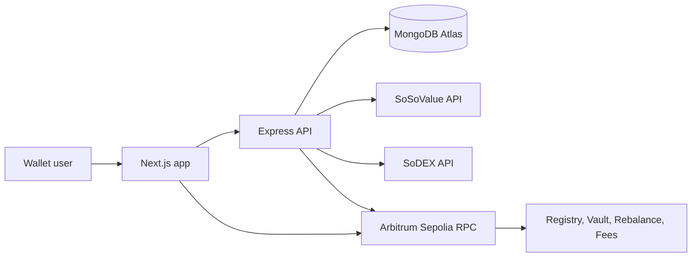

# Architecture

The frontend signs login messages and stores the JWT in localStorage. The backend verifies signatures, persists user and product data, and coordinates optional on-chain operations. Contracts hold the authoritative on-chain basket, vault, rebalance, and fee state.
